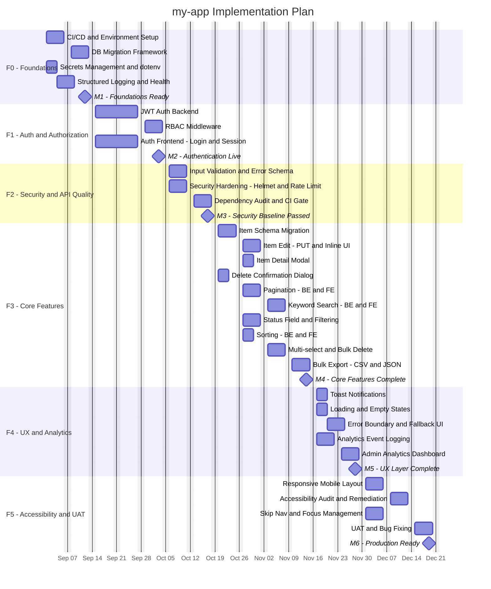

# my-app — Implementation Work Plan

## Executive Summary

This plan sequences the delivery of **10 approved Epics** and **30+ User Stories** identified as feature gaps and enhancement opportunities for **my-app** — a React/Express/SQLite full-stack application currently supporting only anonymous item CRUD. The plan covers six delivery phases over **18 weeks**, staffed by a team of **5 people** (1 Tech Lead, 2 Backend Developers, 1 Frontend Developer, 1 QA Engineer). Work is organized from foundational infrastructure through security, core feature enhancements, UX polish, and analytics — culminating in a production-ready, accessible, and hardened application. The top two delivery risks are **JWT/auth scope creep** (auth touches every layer) and **SQLite schema migration fragility** (multiple stories require coordinated schema changes with zero data loss).

---

## Assumptions

1. **Team is full-time** — all 5 members are 100% dedicated to this project for the duration.
2. **Greenfield enhancements** — the existing my-app codebase (React 18, Express 4, SQLite 3) is the baseline; no legacy system migration required.
3. **Environments** — DEV environment is available from day one; QA and PRD environments must be provisioned during F0.
4. **No SSO/IdP** — authentication uses local accounts (email + bcrypt password) with JWT; no third-party OAuth in scope.
5. **Roles defined** — three roles in scope: `admin` (full access), `editor` (create/edit own items), `viewer` (read-only).
6. **No data migration** — existing SQLite data is dev/test data only; schema migrations run forward with no backward-compatibility requirement.
7. **Client-side routing** — React Router will be introduced to support `/login` and `/analytics` routes.
8. **No real-time** — WebSockets and real-time collaboration are explicitly out of scope.
9. **SQLite retained** — no database engine change; all schema enhancements use SQLite migrations via `db-migrate` or `knex`.
10. **CI/CD exists or will be set up in F0** — GitHub Actions pipeline for lint, test, and build.
11. **Playwright E2E tests** cover happy-path flows; unit tests (Jest/React Testing Library) are added per story where noted.
12. **No payments, notifications (email/SMS), or external analytics services** in scope.
13. **Stakeholder UAT** — one round of UAT is planned in F5 with a 1-week feedback window.
14. **Start date** — Monday, 2025-09-01.

---

## Team Composition

| Role | Count | Key Responsibilities |
|---|---|---|
| Tech Lead / Architect | 1 | Architecture decisions, DB migration strategy, JWT design, code reviews, ADRs |
| Backend Developer (Senior) | 1 | Auth endpoints, JWT middleware, RBAC, rate limiting, security hardening |
| Backend Developer (Mid) | 1 | Schema migrations, CRUD enhancements, pagination, search, bulk ops, export endpoints |
| Frontend Developer (Senior) | 1 | Auth UI, routing, RBAC-aware components, accessibility, responsive layout, error boundary |
| QA Engineer | 1 | Test plans, Playwright E2E tests, accessibility audit (axe), npm audit, UAT coordination |
| **Total** | **5** | |

---

## Module Complexity Sizing (T-Shirt)

| Module / Feature | Epic(s) | Tier | Justification |
|---|---|---|---|
| CI/CD and Environment Setup | F0 | XS | GitHub Actions scaffold; environments to provision; no legacy |
| DB Migration Framework | EPMCDMETST-62952, -63157 | S | Introduce knex/db-migrate; create migration runner; affects all future schema work |
| JWT Auth Backend | EPMCDMETST-62952, -63162 | M | Auth endpoints, bcrypt, JWT sign/verify, refresh token, httpOnly cookie; cross-cutting middleware |
| RBAC Middleware | EPMCDMETST-62952, -63162 | S | Role field in JWT, middleware guard on all mutation routes, 403 handling |
| Auth Frontend - Login UI and Session | EPMCDMETST-62952, -63162 | S | Login page, protected routes, session state, logout |
| Input Validation and Error Schema | EPMCDMETST-62953, -63158 | S | Joi/express-validator server-side; standardised error JSON; client-side inline validation |
| Security Hardening - helmet, CORS, rate limit, sanitisation | EPMCDMETST-62953, -63161 | S | helmet.js, restricted CORS, express-rate-limit, input sanitisation middleware |
| Environment and Secrets Management | EPMCDMETST-62953 | XS | dotenv, .env.example, startup guard for required vars |
| Structured Logging and Enhanced Health | EPMCDMETST-62953 | XS | pino/winston JSON logs, extended /api/health endpoint |
| Item Schema Extension - description, timestamps, status | EPMCDMETST-63160 | S | Migration: 3 new columns; POST/PUT/GET updated; ISO-8601 timestamps |
| Item Edit - PUT endpoint and Inline UI | EPMCDMETST-63157 | S | PUT /api/items/:id; inline edit component; validation |
| Item Detail Modal | EPMCDMETST-63160 | XS | Read-only modal showing all metadata; keyboard accessible |
| Delete Confirmation Dialog | EPMCDMETST-63157, -63162 | XS | Modal component; keyboard management; wired to DELETE |
| Pagination - BE and FE | EPMCDMETST-62955, -63164 | S | limit/offset on GET /api/items; pagination controls in UI; URL state |
| Keyword Search - BE and FE | EPMCDMETST-63164 | S | ?q= filter on GET /api/items; debounced search input |
| Status Filtering - BE and FE | EPMCDMETST-63164 | XS | ?status= filter; filter tabs/dropdown in UI |
| Sorting - BE and FE | EPMCDMETST-63157, -63164 | XS | sort param on GET /api/items; sort controls; URL persistence |
| Multi-select and Bulk Delete | EPMCDMETST-63159 | S | Checkbox column; select-all; bulk DELETE endpoint; confirmation |
| Bulk Export - CSV and JSON | EPMCDMETST-63159, -63163 | S | GET /api/items/export; format param; FE export dropdown; streaming download |
| Usage Analytics and Telemetry | EPMCDMETST-63163 | S | CRUD event logging; events table; admin dashboard page |
| Toast Notifications | EPMCDMETST-63166 | XS | Reusable Toast component; integrated into all CRUD ops |
| Loading and Empty States | EPMCDMETST-63166 | XS | Spinner/skeleton; empty-state illustration; aria-busy |
| Error Boundary and Global Error UI | EPMCDMETST-63166 | XS | React ErrorBoundary; fallback UI; reload action |
| Responsive Mobile Layout | EPMCDMETST-63165 | S | CSS breakpoints 320-1440px; 44px touch targets; modal scroll |
| Accessibility Audit and Remediation | EPMCDMETST-63165 | S | axe audit; ARIA roles; focus management; skip nav; WCAG 2.1 AA |
| Dependency Audit and CI Security Check | EPMCDMETST-63161 | XS | npm audit; update vulns; CI gate |

---

## Phase Summary

| Phase | Name | Weeks | Start | End | Modules in Scope | Tier |
|---|---|---|---|---|---|---|
| F0 | Kickoff and Foundations | 2 | 2025-09-01 | 2025-09-12 | CI/CD, Env setup, DB Migration Framework, Secrets Management | XS-S |
| F1 | Authentication and Authorization | 3 | 2025-09-15 | 2025-10-03 | JWT Auth Backend, RBAC Middleware, Auth Frontend | M+S |
| F2 | Security Hardening and API Quality | 2 | 2025-10-06 | 2025-10-17 | Input Validation and Error Schema, Helmet/Rate Limit/Sanitisation, Structured Logging | S |
| F3 | Core Feature Enhancements | 4 | 2025-10-20 | 2025-11-14 | Item Schema Extension, Edit, Detail Modal, Delete Confirmation, Pagination, Search, Filter, Sort, Bulk Actions, Export | XS-S |
| F4 | UX Feedback and Analytics | 2 | 2025-11-17 | 2025-11-28 | Toast Notifications, Loading/Empty States, Error Boundary, Analytics and Telemetry | XS-S |
| F5 | Accessibility and Observability | 3 | 2025-12-01 | 2025-12-19 | Responsive Layout, Accessibility Audit, Dependency Audit, UAT, Bug Fixes | S |

> **Contingency note:** A 15% schedule buffer (+2 weeks) is embedded within F3 and F5, which are the densest phases. F3 coordinates 10+ stories with schema migrations across BE and FE; F5 requires stakeholder UAT availability and remediation time post-audit. Total plan duration = **16 working weeks** of execution + **2 weeks contingency** = **18 weeks total**.

---

## Milestone Table

| ID | Milestone | Phase | Target Date | Success Criterion |
|---|---|---|---|---|
| M1 | Foundations Ready | F0 | 2025-09-12 | CI pipeline runs green; DB migration framework executes migrations on startup; .env.example committed; DEV and QA environments accessible |
| M2 | Authentication Live | F1 | 2025-10-03 | POST /api/auth/login returns JWT; all /api/items routes return 401 without valid token; login and logout UI functional; role field enforced on DELETE |
| M3 | Security Baseline Passed | F2 | 2025-10-17 | helmet headers present in all responses; rate limiting returns 429 after threshold; npm audit returns 0 high/critical; all API errors return standardised JSON schema |
| M4 | Core Features Complete | F3 | 2025-11-14 | PUT /api/items/:id live; GET /api/items supports limit, offset, q, status, sort; bulk DELETE endpoint tested; CSV/JSON export downloadable; Playwright E2E suite green |
| M5 | UX Layer Complete | F4 | 2025-11-28 | Toast notifications fire on all CRUD success and failure; error boundary renders fallback on crash; loading and empty states present; analytics events table populated |
| M6 | Production Ready | F5 | 2025-12-19 | axe audit returns 0 critical violations; all screens responsive at 320px; UAT sign-off received; all open bugs triaged; final npm audit clean |

---

## Gantt Diagram

---

## Phase Detail Sections

---

### F0 — Kickoff and Foundations
**Duration:** 2 weeks (2025-09-01 to 2025-09-12)
**Team:** Tech Lead, Backend Senior, QA Engineer

**Deliverables:**
- GitHub Actions CI pipeline: lint (ESLint), unit test (Jest), E2E test (Playwright), build
- DEV and QA environments provisioned and accessible
- `db-migrate` or `knex` migration framework integrated; initial baseline migration for `items` table
- `.env.example` committed; `.env` in `.gitignore`; server startup guard for required env vars
- `pino` structured JSON logger replacing all `console.log`; `/api/health` returning `{ status, uptime, dbConnected, memoryUsage }`

**Jira Tasks Covered:**
- EPMCDMETST-62969 (Secrets Management via env vars)
- EPMCDMETST-62971 (Structured logging and monitoring)
- EPMCDMETST-62965 (DB migration system)
- EPMCDMETST-63211 (Migration: description, created_at, updated_at columns schema prep)

**Dependencies:** None — this is the critical path start.

---

### F1 — Authentication and Authorization
**Duration:** 3 weeks (2025-09-15 to 2025-10-03)
**Team:** Tech Lead, Backend Senior, Frontend Senior

**Deliverables:**
- `POST /api/auth/register` and `POST /api/auth/login` endpoints; bcrypt password hashing
- JWT access token (15-min expiry) and refresh token (7-day, httpOnly cookie)
- `POST /api/auth/logout` invalidating refresh token server-side
- JWT authentication middleware applied to all `/api/items` routes (401 on failure)
- Role field (admin, editor, viewer) in JWT payload; RBAC middleware guarding mutation routes (403 on unauthorized)
- React Router introduced; `/login` route with login page; protected route wrapper redirecting unauthenticated users
- Session state preserved across refreshes; Logout button in app header
- UI action buttons (Add, Edit, Delete) conditionally rendered by role

**Jira Stories/Tasks Covered:**
- EPMCDMETST-62962, EPMCDMETST-62963, EPMCDMETST-62964 (Auth and Auth Epic -62952)
- EPMCDMETST-63172, EPMCDMETST-63175, EPMCDMETST-63176 (Auth Epic -63162)
- EPMCDMETST-63212 ([BE] JWT middleware)
- EPMCDMETST-63214 ([FE] Login page and session state)
- EPMCDMETST-63236 ([BE] Role-based permission middleware)
- EPMCDMETST-63224 ([FE] Conditional action buttons by role)

**Dependencies:** F0 complete (DB migration framework, env vars, CI pipeline running).

---

### F2 — Security Hardening and API Quality
**Duration:** 2 weeks (2025-10-06 to 2025-10-17)
**Team:** Tech Lead, Backend Senior, Backend Mid, QA Engineer

**Deliverables:**
- `helmet()` applied globally; CSP, X-Frame-Options, X-XSS-Protection headers in all responses
- CORS restricted to trusted origins via env var whitelist
- `express-rate-limit`: 100 req/15 min per IP on all mutation routes; 429 with `Retry-After` header
- Joi/express-validator: server-side schema validation on POST and PUT; standardised error JSON `{ status, code, message, details[] }`
- Input sanitisation middleware stripping HTML from all string fields; 200-char name limit; 1000-char description limit; 413 on oversized payload
- Client-side inline validation in React: required, max-length, whitespace rules; Submit disabled until valid
- `npm audit` run; all high/critical vulnerabilities resolved; CI step added that fails on high/critical

**Jira Stories/Tasks Covered:**
- EPMCDMETST-62967, EPMCDMETST-62970 (Backend Robustness Epic -62955)
- EPMCDMETST-63180 (Standardised error schema)
- EPMCDMETST-63182 (Client-side input validation)
- EPMCDMETST-63184 (Input length limits and XSS sanitisation)
- EPMCDMETST-63188 (Dependency audit)
- EPMCDMETST-63189 (API rate limiting)
- EPMCDMETST-63190 (User-friendly API error messages)
- EPMCDMETST-63231 ([BE] Standardised error response schema)
- EPMCDMETST-63222 ([BE] Input sanitisation middleware)
- EPMCDMETST-63232 ([BE] express-rate-limit)
- EPMCDMETST-63216 ([FE] Inline form validation)
- EPMCDMETST-63215 ([FE] Map API errors to friendly messages)
- EPMCDMETST-63227 ([BE] npm audit and CI gate)

**Dependencies:** F1 complete (auth middleware must be in place before rate limiting by role).

---

### F3 — Core Feature Enhancements
**Duration:** 4 weeks (2025-10-20 to 2025-11-14)
**Team:** Tech Lead, Backend Senior, Backend Mid, Frontend Senior, QA Engineer

**Deliverables:**

**Schema and Data Model (Week 1):**
- DB migration: `description` (text, nullable), `created_at`, `updated_at`, `status` (active/done/archived, default active) columns added to `items` table
- POST and PUT endpoints updated to accept and persist all new fields
- All item API responses return timestamps in ISO-8601 format
- Status validation (400 on unknown values)

**Item CRUD Enhancements (Weeks 1-2):**
- `PUT /api/items/:id` endpoint with full validation; 404 on non-existent ID
- Inline edit UI: click edit icon, editable field, Save (Enter) / Cancel (Escape)
- Item detail modal: name, description, created_at, updated_at, status; keyboard accessible; Edit and Delete actions inside modal
- Delete confirmation modal with item name; keyboard managed (focus trap; Esc = cancel)
- User-controlled sort: sort param on GET /api/items; sort controls in UI; URL query param persistence

**List Management (Weeks 2-3):**
- `GET /api/items` extended: `?limit=&offset=` (default 20), `?q=` keyword search (SQLite LIKE), `?status=` filter, `?sort=` parameter
- Pagination controls: Previous / Next / page numbers; no full page reload
- Debounced search input (300ms); empty result state shown
- Status filter tabs/dropdown; filter state in URL

**Bulk Actions and Export (Weeks 3-4):**
- Checkbox column in item list; Select All; selection count in action bar
- `DELETE /api/items/bulk` accepting array of IDs; atomic SQLite transaction; confirmation dialog with count
- `GET /api/items/export?format=csv` and `?format=json`; respects current filter/search params; auto-download in browser
- Export dropdown button in list toolbar; loading indicator during generation

**Jira Stories/Tasks Covered:**
- EPMCDMETST-62965, EPMCDMETST-62966 (Backend Robustness)
- EPMCDMETST-63167, EPMCDMETST-63168, EPMCDMETST-63169, EPMCDMETST-63170, EPMCDMETST-63171, EPMCDMETST-63173, EPMCDMETST-63174
- EPMCDMETST-63181, EPMCDMETST-63183, EPMCDMETST-63185, EPMCDMETST-63191, EPMCDMETST-63194, EPMCDMETST-63196
- EPMCDMETST-63198, EPMCDMETST-63199, EPMCDMETST-63200, EPMCDMETST-63201, EPMCDMETST-63202, EPMCDMETST-63203
- EPMCDMETST-63204, EPMCDMETST-63205, EPMCDMETST-63206, EPMCDMETST-63207, EPMCDMETST-63208, EPMCDMETST-63209
- EPMCDMETST-63210, EPMCDMETST-63213, EPMCDMETST-63220, EPMCDMETST-63221, EPMCDMETST-63233, EPMCDMETST-63234, EPMCDMETST-63235

**Dependencies:** F0 (migration framework), F1 (auth middleware on all routes), F2 (error schema for consistent responses).

---

### F4 — UX Feedback and Analytics
**Duration:** 2 weeks (2025-11-17 to 2025-11-28)
**Team:** Frontend Senior, Backend Mid, QA Engineer

**Deliverables:**
- Reusable `Toast` component: success and error variants; top-right position; auto-dismiss 4s; manual dismiss; stacking
- Toast integrated into all CRUD operations (add, edit, delete, bulk delete, export)
- `LoadingSpinner` and `Skeleton` components shown during fetch/pagination; `aria-busy` set
- `EmptyState` component: distinct messages for empty list vs. no search results
- React `ErrorBoundary` wrapping the full app: friendly fallback UI with Reload button; no stack traces exposed; errors logged to console
- CRUD event logging: `events` table (event_type, item_id, user_id anonymised, timestamp); populated on create/update/delete
- Admin analytics dashboard page (`/analytics`): event counts (created, updated, deleted) and API error rate per endpoint; visible to `admin` role only

**Jira Stories/Tasks Covered:**
- EPMCDMETST-62959, EPMCDMETST-62960, EPMCDMETST-62961 (UX Experience Epic -62954)
- EPMCDMETST-63177, EPMCDMETST-63178, EPMCDMETST-63179 (UX Feedback Epic -63166)
- EPMCDMETST-63192, EPMCDMETST-63193 (Data Export and Analytics Epic -63163)
- EPMCDMETST-63217, EPMCDMETST-63218, EPMCDMETST-63219 ([FE] Toast, LoadingSpinner, ErrorBoundary)
- EPMCDMETST-63228 ([FE] Integrate toasts into all CRUD)
- EPMCDMETST-63223 ([BE] CRUD event logging)
- EPMCDMETST-63225 ([FE] Admin analytics dashboard)

**Dependencies:** F3 complete (all CRUD operations finalized before toast/event integration).

---

### F5 — Accessibility, UAT, and Production Readiness
**Duration:** 3 weeks (2025-12-01 to 2025-12-19)
**Team:** Frontend Senior, QA Engineer, Tech Lead (UAT oversight)

**Deliverables:**
- CSS breakpoints for 320-1440px; all interactive elements 44x44px minimum touch target; no horizontal scroll; Add Item form stacks vertically on mobile; modals scrollable on small screens
- Skip-to-main-content link as first focusable element; focus moved to newly added item on create; focus returned to list after modal close; focus moved to next item after delete
- Axe automated accessibility audit: 0 critical violations; all form inputs have labels; all icons have `aria-label`; colour contrast WCAG 2.1 AA (4.5:1); focus indicators visible
- Full Playwright E2E regression run across all new features
- One round of stakeholder UAT (1-week window); bugs triaged and fixed
- Final `npm audit` clean; README updated with all new env vars, API endpoints, and migration instructions

**Jira Stories/Tasks Covered:**
- EPMCDMETST-63186, EPMCDMETST-63187, EPMCDMETST-63195 (Responsive Design and Accessibility Epic -63165)
- EPMCDMETST-63226 ([FE] Responsive CSS breakpoints)
- EPMCDMETST-63229 ([FE] axe audit and fix critical violations)
- EPMCDMETST-63230 ([FE] Skip nav and keyboard focus management)
- EPMCDMETST-62969 (README env var docs - final update)

**Dependencies:** F4 complete (all UI components finalized before accessibility and responsive audit).

---

## Risk Register

| ID | Risk | Probability | Impact | Mitigation |
|---|---|---|---|---|
| R01 | JWT auth scope creep - refresh token flow, logout invalidation, and RBAC middleware touch every API route and the React routing layer simultaneously; risk of integration defects spilling into F2 | High | High | Implement and gate-test auth in isolation on a feature branch before merging to main; add dedicated integration test suite for auth flows before F2 starts |
| R02 | SQLite schema migration failures - F3 adds 4 new columns across 3 migrations; a failed migration in QA or PRD could corrupt the items table or leave the schema in an inconsistent state | Medium | Critical | Write each migration as a single idempotent transaction with rollback; test all migrations on a copy of the production DB before applying; enforce migration-first policy (no code merge without passing migration test) |
| R03 | React Router introduction breaks existing Playwright E2E tests - adding /login route and protected route wrappers in F1 will require all 3 existing Playwright tests to be updated to handle auth flow | High | Medium | Update Playwright tests immediately after login UI is merged in F1; add a shared loginAs() helper to all tests; block F2 merge until E2E suite is green |
| R04 | Rate limiting misconfiguration blocks CI/CD pipeline or integration tests - express-rate-limit at 100 req/15 min could throttle Playwright E2E test runs that issue many rapid requests | Medium | Medium | Configure rate limiter to skip requests from 127.0.0.1 in test environments; use RATE_LIMIT_DISABLED=true env var in CI; document this in README |
| R05 | Bulk DELETE atomicity on SQLite - DELETE /api/items/bulk must execute as a single SQLite transaction; if the connection drops mid-delete, partial deletes leave the DB in an inconsistent state | Low | High | Wrap bulk delete in a BEGIN TRANSACTION / COMMIT / ROLLBACK block; add an integration test that simulates mid-transaction failure |
| R06 | Accessibility remediation volume underestimated - the current UI has no ARIA roles, no skip nav, no focus management; axe audit in F5 may surface 20+ violations exceeding the 1-week fix window | Medium | Medium | Run a preliminary axe scan at the end of F4 to triage violations early; address critical violations (role, label, contrast) during F4 UX phase, leaving only medium/low for F5 |
| R07 | UAT stakeholder unavailability - if the approving stakeholder is unavailable during the 1-week UAT window in F5, sign-off slips the go-live milestone by at least 1 week | Medium | High | Schedule UAT window 2 weeks in advance; nominate a backup approver; prepare a pre-built demo environment (not shared DEV) for UAT |
| R08 | Export endpoint memory pressure - streaming large CSV/JSON exports from SQLite synchronously in Express may cause high memory usage if the items table grows significantly during testing | Low | Medium | Implement export using Node.js streaming (pipe SQLite rows to response stream); set a max export row limit (e.g. 10,000) enforced server-side |
| R09 | Token storage XSS exposure - if the React SPA stores the JWT in localStorage instead of httpOnly cookies, it is vulnerable to XSS theft, which undermines the entire auth effort | High | Critical | Enforce httpOnly cookie storage for tokens as an architectural decision in F1; reject any PR that stores tokens in localStorage or sessionStorage; add CSP header in F2 to block inline scripts |
| R10 | Dependency audit yields breaking version upgrades - updating vulnerable packages in F2 (especially sqlite3, express, react-scripts) may introduce breaking API changes requiring code fixes | Medium | Medium | Run dependency updates on a dedicated branch; use npm-check-updates in minor-only mode first; test all Playwright flows after each batch upgrade |

---

## Notes

### Team Size Justification
Five people is the minimum viable team for this scope. The 30 user stories span three technical layers (BE, FE, DB) and require concurrent work in F3. With only 1 FE developer, F3 FE tasks (inline edit, detail modal, delete confirm, search, pagination, bulk select, export UI) are sequenced rather than parallelized — this is the main driver of F3's 4-week duration. Adding a second FE developer would compress F3 by approximately 1 week, but the current team size is assumed to be a constraint.

### T-Shirt Tier Justification
- **JWT Auth Backend rated M** (not S): the combination of access token + refresh token + server-side invalidation (refresh token store in DB) + RBAC middleware applied to all 4 existing routes + bcrypt password hashing represents more than a standard S-tier REST service. It touches auth, session, and authorization layers simultaneously.
- **Item Schema Extension rated S** (not XS): three concurrent column additions to a live SQLite table, coordinated with POST, PUT, and GET endpoint updates, and requiring a zero-data-loss migration run in sequence, exceeds the XS CRUD threshold.
- **Pagination rated S** (not XS): requires backend query modification (limit/offset), response envelope restructure (`{ data, total, page, limit, totalPages }`), and a non-trivial FE pagination component with URL state management.
- **Accessibility Audit rated S**: axe audit alone is fast, but the subsequent remediation of ARIA roles, focus management, skip navigation, label associations, and contrast fixes across all newly built components in F3 and F4 constitutes 1-2 weeks of targeted FE work.

### Phase Duration Justification
- **F1 (3 weeks)**: JWT auth is rated M-tier; the FE login/session work runs in parallel but cannot be tested until the BE auth endpoints are stable (end of week 1). Week 3 is used for integration testing of the full auth flow and RBAC enforcement.
- **F3 (4 weeks)**: The densest phase — 10+ stories across BE and FE with schema migrations as a hard dependency. The migration must complete and be verified before any CRUD enhancement code can be merged. A 1-week contingency buffer is embedded here.
- **F5 (3 weeks)**: Includes a 1-week UAT window that cannot be compressed (stakeholder availability) plus a post-UAT bug-fix window and final audit pass.

### Schedule Contingency
**15% buffer = 2 weeks** applied across the plan, embedded in F3 (1 week) and F5 (1 week implicit in the 3-week allocation for a 2-week technical scope). Risk factors justifying this buffer: (R01) auth scope creep, (R02) migration fragility, (R03) E2E test rework post-React Router introduction, and (R06) accessibility remediation volume uncertainty.

### Parallelism
- **F1**: JWT Backend (Backend Senior) and Auth Frontend (Frontend Senior) run in parallel from day 1 of F1. Auth FE uses mock data / stub responses for the first 5 days until BE endpoints are available.
- **F2**: Input validation (Backend Mid) and security middleware (Backend Senior) run in parallel; both complete in week 1 of F2, leaving week 2 for integration testing and npm audit.
- **F3**: Schema migration is the hard dependency for all F3 work. After migration is verified (end of week 1), BE and FE tracks run in parallel: BE Mid handles pagination/search/filter/sort/bulk/export endpoints; FE Senior handles UI components for all of the above.
- **F4**: Analytics backend (Backend Mid) and UX components (Frontend Senior) run in parallel from the start of F4.

### Integration Complexity
The introduction of JWT auth in F1 has a cascading impact on all subsequent phases: every Playwright E2E test must be updated to authenticate before accessing `/api/items`; every API call in the React app must attach the Authorization header or rely on the cookie; and every new backend endpoint in F3 must be guarded by the auth middleware. This cross-cutting concern is the primary driver of the F1 gate — no F2 or F3 work begins until auth is merged and all existing tests are green.

### UAT Duration
One week of UAT is scheduled for F5. The app is not a complex domain system (no financial workflows, no multi-tenant data isolation beyond user scoping), so 1 week is appropriate. However, given that auth, RBAC, and new CRUD semantics are all new to stakeholders, we allocate an additional 4-day bug-fix window immediately following UAT before declaring the milestone closed.
